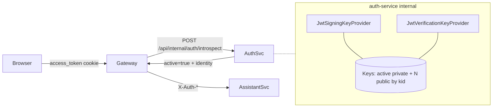

# Pixels Rover JWT 非对称签名与密钥轮换设计（沿革档案）

> 本文档是 Pixels Rover 从对称 `HS256` 迁移到非对称 `RS256 + kid + 多公钥并存` 的设计沿革档案，长期保留（随代码仓库发布）。
>
> **架构前提（必读）**：本文档基于 **gateway-centric 架构**——业务服务不接触 JWT，网关通过 `introspect` 消费身份。因此：
>
> - 私钥 / 公钥 / 轮换逻辑的作用面**仅限 `auth-service` 进程内部**；
> - **不向** `assistant-service` / gateway 分发公钥，两者都不参与 JWT 验签；
> - 对浏览器和下游服务的身份判定由 gateway 的 `POST /api/internal/auth/introspect` 子请求承担，JWT 对二者透明。
>
> 如果未来架构回到"业务服务自校验 JWT"形态，本文档需要整体重写。
>
> 约束：
>
> - 本文件只记录**设计决策**，不是可执行 Runbook；实际演练步骤见 [`../runbooks/jwt-rotation-drill.md`](../runbooks/jwt-rotation-drill.md)。
> - 当前代码已具备 `HS256` / `RS256` 双模式能力，但默认运行态与各环境的实际签名算法以各环境的 `.env` / 配置中心为准。
> - 与 [`../development/backend.md`](../development/backend.md) / [`../development/gateway.md`](../development/gateway.md) 冲突时以 dev 文档为准。

## 1. 目标与非目标

### 1.1 目标

把 `auth-service` 当前的对称签名 JWT 方案（`HS256` 共享密钥）升级为：

- `auth-service` 用 `RS256` 私钥签发 JWT；
- `auth-service` 用多把历史公钥并存做轮换期兼容校验；
- 通过 `kid` 平滑轮换，轮换期内新旧 token 都能在 `introspect` 路径上被正确识别。

### 1.2 非目标

- **不**把 JWT 校验能力下放到 gateway 或 `assistant-service`——这违反 [`../development/backend.md`](../development/backend.md) §3.2 与 [`../development/gateway.md`](../development/gateway.md) §3 的硬规则。
- **不**以 "向下游分发公钥" 作为 `assistant-service` 校验身份的实现路径——身份只来自 gateway 注入的 `X-Auth-*` 头。
- **不**覆盖其他 secret（数据库密码、`INTERNAL_*_SECRET` 等）的轮换；那是独立工程主题。

## 2. 当前问题

当前对称方案的主要风险：

- 任何持有 `HS256` 密钥的进程既能签发也能伪造 token，边界等同；
- 多环境部署时密钥副本扩散，泄露面线性放大；
- 不支持多版本密钥并行校验，轮换时只能"硬切换 + 瞬间断流"。

这意味着对称方案适合开发与第一阶段联调，但不适合长期生产使用。

## 3. 目标方案概览

推荐采用：

- JWT 签名算法：`RS256`
- **签发方**：`auth-service`（持有当前激活的 RSA 私钥）
- **校验方**：**同样只有 `auth-service`**。`gateway` 通过 `introspect` 子请求拿到 `active=true/false` 与身份字段，不直接参与 JWT 校验；`assistant-service` 只消费 `X-Auth-*` 头。
- 密钥标识：JWT header 必含 `kid`
- 多公钥并存：`auth-service` 内部持多把历史公钥，覆盖轮换期

统一设计如下：

1. `auth-service` 持有一把当前激活的 RSA 私钥与若干把并存的历史 RSA 公钥；
2. 签发 JWT 时在 header 中写入激活 `kid`；
3. `auth-service` 的验签路径（`introspect` / `refresh` / session 活性判断）按 `kid` 选择对应公钥；
4. 轮换期间多把公钥同时有效；
5. 新 token 只由激活私钥签发；
6. 旧 token 在自然过期后随之失去意义，随后可下线对应公钥。



关键边界：**图中 `Keys` 永远不离开 auth-service 进程**。

## 4. 目标 JWT 结构

### 4.1 Header

JWT header 至少包含：

```json
{
  "alg": "RS256",
  "typ": "JWT",
  "kid": "2026-rot-a"
}
```

**硬规则**：无 `kid` 或 `kid` 未在 auth-service 当前公钥表中 → 校验直接失败（见 §9）。

### 4.2 Payload

payload 继续保留当前核心字段：

- `iss`: `pixels-rover-auth-service`
- `sub`: 用户邮箱
- `uid`: 用户 ID
- `type`: `access` 或 `refresh`
- `iat`
- `exp`

如果后续接入权限模型，可继续增加：

- `roles`
- `tenantId`
- `sessionId`

但第一阶段不要把权限扩展和密钥轮换耦合在一起。

## 5. 密钥模型设计（auth-service 独占）

auth-service 侧新增以下配置概念：

- `jwt.algorithm=RS256`
- `jwt.issuer=pixels-rover-auth-service`
- `jwt.active-kid=2026-rot-a`
- `jwt.private-key-pem=...`（仅激活 `kid` 对应的私钥）
- `jwt.public-keys[2026-rot-a]=...`
- `jwt.public-keys[2026-rot-b]=...`

职责划分：

- **私钥**：仅 auth-service 持有，只用于签发。进程外无副本。
- **公钥**：仅 auth-service 持有（同进程内），用于自校验（`introspect` / `refresh` / session 撤销判定）。**不分发**给 gateway 或 assistant-service。
- **激活 `kid`**：决定新签发 token 使用哪把私钥。

> 与旧版设计的差异：早期版本曾描述 "Python `assistant-service` 配 `ROVER_JWT_PUBLIC_KEYS_JSON` 做自校验" 的形态。该形态在 gateway-centric 架构下已废弃——业务服务不校验 JWT，配置项不再需要。

## 6. 公钥分发方案

> 在 gateway-centric 架构下，"分发"仅指**在 auth-service 不同实例 / 不同环境副本之间**同步公钥表；不涉及跨服务分发。

### 阶段 A：配置分发（当前阶段）

适合当前项目阶段，实施成本最低。

做法：

- auth-service 从环境变量或配置中心读取一组公钥 + 一把激活私钥；
- 部署时统一更新配置；
- 多实例部署时由配置管理平面保证各 auth-service 实例拿到相同的公钥集合。

优点：

- 实现简单；
- 不引入额外网络依赖。

缺点：

- 公钥更新依赖配置发布；
- 轮换自动化程度有限。

### 阶段 B：JWKS 端点（可选，用于外部互认）

`auth-service` 可以把 JWKS 作为**对外可选能力**暴露，典型用途是与外部 IdP / 第三方系统做 token 互认（例如对接企业 SSO、把 `auth-service` 当作 OP 提供 ID Token）。

做法：

- `auth-service` 暴露只读 JWKS 端点（例如 `GET /.well-known/jwks.json`）；
- 外部互认方按标准 OIDC discovery 流程拉取并缓存。

**硬边界**：即使启用 JWKS 端点，Pixels Rover 系统内部的 `gateway` / `assistant-service` **仍然不消费** JWKS——它们的身份入口分别是 `introspect` 与 `X-Auth-*` 头。JWKS 是对系统外的出口，不是系统内的耦合点。

#### 阶段 B 当前状态与 grep 兜底（重要）

当前阶段**代码层面已完成 JWKS 下线**：`auth-service` 源码中与 `/.well-known/jwks.json` / `JwksController` / `JwkSetRepresentation` / `toJwksPublicKey()` 相关的类、路由、测试一律删除——不保留"注释掉"或"`@ConditionalOnProperty`"这类"预留空位"形态。历史上"注释保留"只会让代码库里出现不活跃的分支，新同学以为它还能被重新启用、反复试图复活却不知道需要补的协议细节，反而比直接删掉更危险。

作为**防止意外复活**的兜底，`scripts/check-contracts.py` 运行一条 grep 断言：对上述符号名在 `services/auth-service/src/**` 做正则扫描，任一命中即 CI fail，错误提示指向本节。该断言**不是 bug**——它是"下线决策的长期执行器"，与本节 §1.2 的架构前提（业务服务不接触 JWT）成对存在。

**断言的 sunset 条件（何时可以删除该 grep 断言）**：

当 Pixels Rover 真的出现"对接外部 IdP / 第三方 SSO"的需求、并完整走完下节"复活清单"后，`check-contracts.py` 中对应断言一并在**同一次 PR**里删除（不留注释式保留）；断言的"使命已完成"等价于 JWKS 端点已被正式引入为 §6.B 的活跃形态。PR review 必须在同一次改动中看到：新端点实现 + 本文档 §6.B "当前状态" 更新为"已启用" + `check-contracts.py` 断言删除——三者缺一视为中间态，退回。

#### 复活清单（Resurrection Checklist，出现外部互认需求时使用）

若未来系统需要引入 JWKS 端点，**不得**仅"把删掉的文件 git revert 回来"——架构前提、运维契约、轮换语义都需要一起复核。下列清单**必须逐条显式通过**，任一未通过即 PR 不予合并：

1. **更新架构前提**：在本文件顶部"架构前提"块里追加复活记录（时间 / 驱动场景 / 新的对外消费方列表）；明确列出该 JWKS 端点**只服务于哪些外部系统**，同时重申"`gateway` / `assistant-service` 仍然不消费 JWKS"的系统内硬边界（§1.2）。
2. **绑定密钥模型**：确认 §5 的多公钥并存机制（`auth-service` 内部枚举密钥目录）可以直接作为 JWKS 的数据源——`kid` / 算法 / 公钥材料的产出路径与 JWKS 序列化的输入路径一一对应；如果 §5 的形态在此之前发生变更，先补 §5，再动 §6.B。
3. **界定缓存与 TTL**：JWKS 端点对**外**下发的 `Cache-Control` / ETag / `max-age` 策略需与外部互认方的 OIDC discovery 缓存周期可用；本节显式声明基线值（例如 `Cache-Control: public, max-age=3600`）并写入 `apisix.yaml` 对该路由的响应头下发规则。
4. **路由规划**：该端点**必须**经过 gateway 暴露（不允许直连 auth-service 端口），且路由**匿名可访问**（OIDC discovery 协议要求）——在 `apisix.yaml` 显式为 `/.well-known/jwks.json` 加一条不挂 `gateway-auth` 插件的路由，避免被默认鉴权链污染；限流按客户端 IP 维度单独配置。
5. **轮换语义联动**：§7 标准轮换步骤中"加入新公钥" / "下线旧公钥"两步需同步说明 JWKS 下发时序——新公钥**先**进 JWKS 被外部拉取到，**再**切 `jwt.active-kid`；旧公钥**先**等外部 discovery 最长 TTL 自然过期，**再**从 JWKS 移除（否则外部互认方会出现"拉到新 JWKS 但本地还缓存着旧公钥"的短窗口）。该联动写入 §7 本节而非运维 runbook——因为它是**设计级约束**，实现时写不对会直接破坏轮换正确性。
6. **删除 grep 兜底**：同一次 PR 里删除 `scripts/check-contracts.py` 对 JWKS 符号名的禁止扫描（见上节"sunset 条件"）；**不得**保留"仅作为警告"的中间态。
7. **OpenAPI 与前端镜像**：若 JWKS 端点对本项目 frontend **不消费**（默认情形），不需要更新 `frontend/src/shared/types/**`；若有本项目内的新消费方（例如未来自研 IdP 客户端），按 [`../development/backend.md §9`](../development/backend.md) / [`../development/frontend.md`](../development/frontend.md) 正常流程扩展。

**反模式（不允许）**：

- ❌ "先把 JWKS 端点开起来，将来再看谁用"——对外接口没有确定消费方时不开；防止"预留的对外端点"变成后续拆不掉的协议承诺。
- ❌ "JWKS 端点同时喂给本项目的 gateway / assistant-service"——违反 §1.2 架构前提硬边界；系统内部只走 introspect。
- ❌ "复活时先跳过几步验收"——本节 1–7 逐条显式通过是下次重新引入的硬准入门槛，不允许 PR review 阶段以"后面补"为由放行。

## 7. 密钥轮换流程

### 7.1 轮换前提

必须先支持：

- token header 中带 `kid`
- auth-service 内部校验支持多把公钥并存

否则不要进入轮换。

### 7.2 标准轮换步骤

以从 `2026-rot-a` 轮换到 `2026-rot-b` 为例：

1. 生成新密钥对 `2026-rot-b`；
2. 将新公钥加入 auth-service 的公钥集合（配置发布到所有 auth-service 实例）；
3. 保留旧公钥 `2026-rot-a`；
4. 将 auth-service 的 `jwt.active-kid` 切换为 `2026-rot-b`；
5. 新签发 token 开始使用 `2026-rot-b`；
6. 等待旧 token 自然过期（见 §7.3）；
7. 确认系统中已无 `2026-rot-a` 存量 token 依赖；
8. 下线旧公钥 `2026-rot-a`。

### 7.3 最短保留窗口

旧公钥最短保留时间应至少覆盖：

- `refresh token` 最大有效期
- 再加一段部署传播缓冲时间

以当前配置为例：

- access token：1 小时
- refresh token：7 天

因此旧公钥建议至少保留：

- `7 天 + 配置传播缓冲`

否则会出现旧 refresh token 无法再换新 access token 的问题。

## 8. refresh token 与轮换关系

在未实现 refresh token 轮换前，需要特别注意：

- refresh token 本身也是 JWT；
- refresh token 也会携带 `kid`；
- refresh token 校验时同样依赖旧公钥在 auth-service 内部保留。

所以当前阶段：

- 不能在切换激活私钥后立即移除旧公钥；
- 必须等待旧 refresh token 彻底自然过期。

后续如果引入 refresh token 轮换与会话表持久化签发记录，可以缩短旧公钥保留窗口。

## 9. 失败场景与错误语义

auth-service 内部的所有 JWT 校验失败场景统一映射到 **`AUTH_*`** 业务领域前缀（符合 [`../development/backend.md`](../development/backend.md) §6.3 的命名空间硬规则）：

| 场景 | HTTP | `details.errorCode` |
|---|---|---|
| 缺少 `kid` | 401 | `AUTH_INVALID_TOKEN` |
| `kid` 未知 | 401 | `AUTH_INVALID_TOKEN` |
| 签名校验失败 | 401 | `AUTH_INVALID_TOKEN` |
| token 过期 | 401 | `AUTH_INVALID_TOKEN` |
| issuer 不匹配 | 401 | `AUTH_INVALID_TOKEN` |
| token 类型错误（access/refresh 串用） | 401 | `AUTH_INVALID_TOKEN_TYPE` |

**重要边界**：

- 上表是 auth-service **内部语义**。这些错误码只会出现在 auth-service **自身接口**（`/api/v1/auth/refresh` 的 401 响应、`POST /api/internal/auth/introspect` 之外的自持路径）。
- `POST /api/internal/auth/introspect` 走 [`../development/backend.md`](../development/backend.md) §8.6.1 的 RFC 7662 裸 schema——token 非法时返回 `200 + { "active": false }`，**不**返回 401 + `AUTH_INVALID_TOKEN`。
- gateway 拿到 `active=false` 后按 [`../development/gateway.md`](../development/gateway.md) §5.1 翻译为 `401 GATEWAY_AUTH_REQUIRED`，对浏览器暴露的永远是 `GATEWAY_*` 基础设施前缀，而不是 `AUTH_*`。两套命名空间在语义上严格不重叠。

> 按 [`../development/gateway.md`](../development/gateway.md) §5 / §6.2 的决策，**面向浏览器的对外响应禁用 401/403 以外的认证语义漂移**；gateway 会统一把上游 `active=false` 翻译成 `401 GATEWAY_AUTH_REQUIRED`、把 CSRF 失败翻译成 `403 GATEWAY_CSRF_INVALID`、把 introspect 不可达翻译成 `503 GATEWAY_INTROSPECT_UNAVAILABLE`。本节的 `AUTH_*` 只在 auth-service 自己的业务响应里使用。

## 10. 配置与实现建议

### 10.1 auth-service 实现建议

建议新增一个密钥管理抽象，例如：

- `JwtSigningKeyProvider`
- `JwtVerificationKeyProvider`

职责：

- 根据 `activeKid` 提供当前签发私钥；
- 根据 `kid` 返回对应公钥；
- 支持从 PEM 或配置中心加载。

`JwtTokenProvider` 需要调整为：

- 签发时在 header 写入 `kid`；
- 校验时按 `kid` 选择公钥；
- 默认拒绝无 `kid` 或未知 `kid` 的 token（对应 §9 `AUTH_INVALID_TOKEN`）。

### 10.2 配置命名建议

建议未来统一为：

- `jwt.algorithm=RS256`
- `jwt.issuer=...`
- `jwt.active-kid=...`
- `jwt.private-key-pem=...`
- `jwt.public-keys-json=...`

如果仍保留对称签名作为过渡，还可以增加：

- `jwt.mode=hmac|rsa`

用于灰度迁移。

> 旧版配置建议中曾包含 `ROVER_JWT_ALGORITHM` / `ROVER_JWT_ISSUER` / `ROVER_JWT_PUBLIC_KEYS_JSON` 三个环境变量，原本用于 `assistant-service` 自校验 JWT。gateway-centric 架构下 `assistant-service` 不校验 JWT，**这三个变量应从部署模板中移除**，避免"配了但不生效 / 有人以为它是真源"的漂移。

## 11. 分阶段落地建议

### 第一阶段：设计完成

- 明确 `RS256 + kid + 多公钥校验` 为目标方案；
- 文档固定密钥轮换流程和保留窗口。

### 第二阶段：auth-service 支持双模式

- auth-service 同时支持 `HS256` 与 `RS256`；
- auth-service 内部校验路径增加 `kid` 解析与多公钥校验；
- **assistant-service / gateway 无需改动**（它们本就不参与 JWT 校验）。

当前代码状态：

- 这一阶段在 auth-service 已基本完成；
- 默认配置仍保持 `HS256`；
- 下一步是准备并执行首次 `RS256` 切换。

### 第三阶段：切换到 RS256

- 目标环境先发布公钥配置到 **所有 auth-service 实例**；
- 将 auth-service 签发切换到 `RS256`；
- 保留对旧模式兼容的短暂窗口（处理已签发的存量 `HS256` token）。

实施 Runbook：

- [`../runbooks/jwt-rotation-drill.md`](../runbooks/jwt-rotation-drill.md)（预发演练 + 密钥轮换演练合并版）

### 第四阶段：启用轮换

- 引入第二把 RSA 密钥；
- 验证轮换流程；
- 形成标准运行手册。

## 12. 当前结论

对于 Pixels Rover，下一代生产级 JWT 方案明确为：

- 算法：`RS256`；
- header：强制包含 `kid`；
- 签发与校验：**只在 auth-service 进程内部**；
- 分发：auth-service 多实例间配置同步；系统内部不跨服务分发公钥；
- 对外互认：JWKS 端点作为未来可选能力，不属于当前路径；
- 轮换：多公钥并存，等待旧 refresh token 过期后移除旧公钥。

这套方案能够在不改变 gateway-centric 身份消费契约的前提下，把当前"共享对称密钥"的风险收敛到更适合工业生产的水平——**JWT 密钥永远不离开 auth-service 进程内存，其余服务对 JWT 无感知**。
