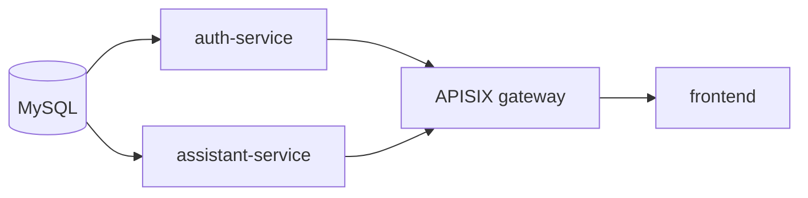

# 后端服务开发指南（跨服务接入契约）

本文档固定 Pixels Rover **后端服务** 的接入契约与边界规范。

- 适用范围：仓库中 `services/*` 下的任何后端服务，以及未来新增的插件式业务服务。
- 设计前提：
  - 产品形态是 **microservice behind API gateway**：每个服务通过 gateway 的统一接入规范对外暴露 HTTP/SSE API，浏览器不直连；
  - 每个服务自带数据边界，短期不横向互调；
  - 内部实现（语言、框架、DI、代码组织、ORM、日志库）由各服务自由决定。
- **本文档只规定"服务如何接进系统"的契约，不规定"服务内部如何实现"**。后者属于各服务团队自己的决策空间，不在本仓库规范范围内。
- 与 [`./gateway.md`](./gateway.md) 互为镜像：`gateway.md §7` 从网关视角写"怎么接入新服务"，本文档从服务视角写"接入要满足什么"。二者需要同步维护。

---

## 1. "插件式后端" 在本项目的确切含义

在本仓库的语境下，"插件式后端"**不是**同进程插件（OSGi / VSCode extension / APISIX 自定义插件那种），而是：

> **每个后端服务通过 gateway 的统一接入规范注册进来，对外只暴露 HTTP/SSE API；浏览器不直连、服务之间短期不横向调用；gateway 用"身份头 + 路由前缀 + CORS / 限流 / 审计"作为唯一接入面。**

基于这个定义：

- **服务内部实现**：自由。`auth-service` 用 Spring Boot，`assistant-service` 用 FastAPI，未来新服务可以用 Go / Rust / Node，只要满足本文档列出的契约。
- **服务接入面**：**必须** 遵守下面 §3–§11 的所有契约，否则服务不是"插件"而是"异物"——能跑，但会污染整体系统的观测、鉴权与运维假设。

---

## 2. 服务拓扑硬约束

所有后端服务必须满足：

1. **浏览器不直连**：`docker-compose.yml` 里只 `expose` 内部端口，**不 `ports`**；所有浏览器流量必须过 gateway。
2. **独占数据域**：每个服务拥有自己的数据库/schema（`pixels_auth` 归 `auth-service`，`pixels_analysis` 归 `assistant-service`，未来新服务走 `pixels_<domain>`）。**禁止跨服务直接读对方的表**。
3. **无横向调用（短期）**：服务之间短期不互相调用。如果出现必须互调的场景，单独评估（候选方案：走内部鉴权的 HTTP 接口；绝不走直连数据库）。
4. **按领域注册路由前缀**：`/api/v1/<domain>*`，以领域命名而不是以实现细节命名（反例：`/api/v1/mysql-stuff/*`、`/api/v1/duckdb/*`）。
5. **依赖关系单向**：服务只能依赖 `auth-service` 提供的身份（经过 gateway 注入的头），不得反向。

### 2.1 启动依赖图

新同学接手时最常见的问题是"我起一个服务为什么连不上"。以下依赖图用于一眼定位启动序，**compose / 运维脚本的 `depends_on` 与就绪等待链应与此图保持一致**：



说明：

- `auth-service` / `assistant-service` 的启动必须在 MySQL **schema 可用**之后（schema 由 `db/pixels_rover.sql` 通过 MySQL `initdb.d` 初始化，见 §12.1）；服务本身只探 `/health`（§7.1），不级联探 DB。
- `gateway` 的 `/gateway/ready` 聚合上游 `/health`，因此业务链上"服务就绪"→"网关就绪"是顺序关系；具体聚合契约见 [`./gateway.md §4.1`](./gateway.md)。
- `frontend` 运行期依赖通过 gateway 统一入口反向代理，不直连后端服务。

---

## 3. 身份契约

### 3.1 必须做

- **只消费** gateway 注入的身份头：
  - `X-Auth-User-Id`
  - `X-Auth-User-Email`
  - `X-Auth-Session-Id`（可选）
- 在每个受保护接口的入口处读取这三个头，并把 `userId` 作为本次请求的主身份参与所有后续判断。

### 3.2 禁止做

- ❌ 自己解 JWT / 读 `access_token` cookie
- ❌ 调 `auth-service` 的 `/api/internal/auth/introspect`（gateway 已做，重复调用会放大 auth-service 压力并破坏缓存策略）
- ❌ 读 `pixels_auth.user` 表或任何 auth-service 的内部表
- ❌ 信任请求 body 或 query 里客户端传来的 `userId` 字段——永远只以 `X-Auth-User-Id` 为准

### 3.3 边界情况：缺失 `X-Auth-User-Id` 的处理

**"缺失"的两种等价情形**，必须走同一分支：

1. **头完全不存在**（`getRequestHeader("X-Auth-User-Id") == null`）；
2. **头存在但值非法**：空串、纯空白、负数、非 parse-able 的格式（例如身份 ID 应为正整数而收到 `"abc"` / `"-5"` / `""`）。

**为什么要把"非法值"并入"缺失"而不单独给一个错误码**：这两种情形都属于"接入面事故"——请求要么没经过 gateway、要么 gateway 注入时出了 bug。让代码层区分两种情形会诱导"头非法 → 400 参数错误"这种按领域异常处理的误写，把接入面故障降级成业务错误、错过 critical 告警。

**落地建议**：在 filter / middleware 层前置一个 `IdentityHeaderValidationFilter`（与 `InternalAuthFilter` 是对偶侧），对接入面硬校验一次性完成，**不要**让每个 controller 自己判断。

受保护接口收到上述任一情形时，**必须**：

1. **HTTP 状态码返回 500**（不是 401，不是 503）。
2. **响应体 `details.errorCode` 固定为 `GATEWAY_IDENTITY_MISSING`**（使用基础设施前缀 `GATEWAY_*`，不使用业务领域前缀，因为它表达的是接入面故障而非任何领域的业务错误；见 §6.3 命名空间约定）。
3. **服务端日志打 `level=critical`**，字段包含 `requestId` / `method` / `uri` / 入站 `Host` / 真实源 IP / 触发分支（`missing` vs `malformed`）。
4. **message 固定为** `"Gateway identity headers missing"`（简短、面向调用方、不暴露诊断细节）。更完整的诊断语境——"请求是否绕过了 gateway"、"gateway 路由是否漏配 `gateway-auth`"、"入站 Host / 真实源 IP"、"头值是否为非法字符串"——只写进第 3 条要求的 `level=critical` 结构化日志，不落在响应 message 里（遵守 §6.0 `message` 边界）。

**为什么是 500 而不是 401 / 503**：

- **不是 401**：到达业务服务的请求一定已通过网关的 AuthN；服务自己不做 AuthN（见 §3.2）。返 401 会让调用方误以为"重新登录就能解决"，掩盖真正的配置故障。
- **不是 503**：503 的语义是"某个可恢复的下游依赖瞬时不可用，稍后重试可能成功"。缺身份头不是"瞬时"而是"配置错误"——路由漏配 `gateway-auth`、服务被直连（绕过网关）、apisix.yaml 回滚后遗漏——这些事情不会因为"稍后重试"就自愈。
- **是 500**：明确告诉监控系统"服务端遇到了不应发生的情况"，触发 critical 告警而非普通错误计数；同时在不暴露内部细节的前提下给调用方一个不可误读的信号。

**正常情况下，服务永远不会收到无身份头的受保护请求**——出现即事故，不是业务。

### 3.4 特殊服务：`auth-service` 的接入定位

`auth-service` 在系统中有双重身份：

1. **AuthN 真源**：持有 JWT 签名/验签密钥、持有 session 表、对外提供 `introspect`。
2. **普通业务服务**：对外提供 `/api/v1/auth/me`、`/api/v1/auth/logout`、`/api/v1/auth/sessions*` 等**用户面** REST 接口，与 `assistant-service` 的业务接口并无本质差异。

**硬规则**：把这两种身份在**代码层彻底切开**，不允许混在同一条 `SecurityFilterChain`、同一条 URL 规则、同一套身份识别逻辑里。

| 接口类型 | URI 前缀 | 身份来源 | 是否允许持有/解码 JWT |
|---|---|---|---|
| **内部接口**（introspect、JWKS 等） | `/api/internal/auth/*` | 由服务自己在 §8.6 `InternalAuthFilter` 中校验 `X-Internal-Auth` secret | ✅ **允许**（只在这一个区域） |
| **用户面业务接口** | `/api/v1/auth/*`（除 `login` / `register` / `captcha` / `refresh` 四个公开路由外） | **只读 `X-Auth-User-Id` / `X-Auth-User-Email` / `X-Auth-Session-Id`**，与 §3.1 完全一致 | ❌ **禁止** |
| **公开 POST**（`login` / `register` / `captcha`） | `/api/v1/auth/*`（具体四条） | 不需要身份 | ❌ **禁止** |
| **`refresh`**（特殊） | `/api/v1/auth/refresh` | 从 `refresh_token` cookie 读（这是业务逻辑，不是身份识别） | ❌ **禁止** 在 Security 层解 JWT；只允许在 controller 内把 cookie 值当字符串 token 交给 `SysLoginService` 做轮换逻辑 |

**为什么要这么拆**：

- auth-service 如果在用户面也自己解 JWT，相当于同一个请求在 gateway 和 auth-service 处被验两次；**两处验签逻辑一旦漂移**（例如 gateway 的 introspect 结果被 cache 命中而 auth-service 直接解 token 拿到更新的 claims），就会出现"同一用户在同一请求里被看作两个身份"这种极难排查的故障。
- 更深一层：auth-service 的用户面接口**本质上和 `assistant-service` 没有区别**——只是恰好把 session 表放在 `pixels_auth` 里。把它按普通业务服务看待，`backend.md §3.1/§3.2` 所有条款都直接适用，规范就不需要为 auth-service 单独开口子。
- JWT 解码能力是 **auth-service 的内部能力**，这个能力只在 `/api/internal/*` 和内部 service 层（签发、轮换、撤销）使用；"能不能解 JWT"和"接口对外是什么语义"是两件事，按 URI 空间彻底切开。

**边界精确定义：是 `SecurityFilterChain`，不是代码调用栈**。

上面的"禁止持有/解码 JWT"**不是**在说 `SysLoginService.refreshToken()` 或 `JwtTokenProvider` 这些内部 service/provider 层不能碰 JWT——它们恰恰就是为碰 JWT 存在的。真正的边界是：

- ✅ **允许**：service / mapper / provider 层内部把 cookie 取出来的字符串当作 token 交给 `JwtTokenProvider` 做验签、轮换、session 活性判断。这是领域逻辑。
- ❌ **禁止**：把 `JwtAuthenticationFilter` 挂到 `/api/v1/auth/**` 的 `SecurityFilterChain`。
- ❌ **禁止**：在用户面 controller 里走 `SecurityContextHolder.getContext().getAuthentication()` 拿身份。
- ❌ **禁止**：在用户面 controller 里调 `jwtTokenProvider.getUsernameFromToken(cookieValue)` 来"识别当前请求的用户身份"——这个判断应该只来自 `@RequestHeader("X-Auth-User-Id")`。

**判定口诀**：如果一个调用栈起点是"web 层（filter 或 controller）要知道当前请求是谁"，就**必须**只读 `X-Auth-*` 头；如果起点是"领域逻辑要处理某个 token 字符串"（比如 refresh 轮换、logout 撤销），那 JWT 解码是这个领域本来就要做的事，和身份识别无关。两件事被新人混为一谈是历史上最常见的漂移源。

**落地动作**：

- 拆分 `SecurityFilterChain` 为两条：`internalApiChain`（`/api/internal/**`，用 `InternalAuthFilter`）、`publicAndUserChain`（`/api/v1/auth/**` 及 `/health`，无 JWT filter）。
- 删 `JwtAuthenticationFilter` 在用户面链路上的挂载；`/me` / `/logout` / `/logout-all` / `/sessions*` 从 `SecurityContextHolder` 换到 `@RequestHeader("X-Auth-User-Id")`。
- 用户面 controller 参数**必须**用 `@RequestHeader(name="X-Auth-User-Id", required=true)`（**不是** `required=false`）。头缺失时 Spring 抛 `MissingRequestHeaderException`，由 §6.5 的 `GlobalExceptionHandler` 兜成 `500 + details.errorCode="GATEWAY_IDENTITY_MISSING"`（和 §3.3 完全一致）。这样"接入面事故"在代码层就不会被某个 controller 悄悄忍掉。
- `resolveCurrentSessionId` 这类辅助函数不再从 cookie 解 JWT，直接读 `X-Auth-Session-Id`。
- **`/api/v1/auth/refresh` 的硬边界**：controller 层从 `refresh_token` cookie 取字符串、交给 `SysLoginService` 做轮换与 session 活性判断；**不经过** `JwtAuthenticationFilter`、**不用** `SecurityContextHolder`、**不在** controller 里调 `jwtTokenProvider.getUsernameFromToken(...)` 作为"识别当前请求者"的依据（该调用只应作为"这个 token 字符串在业务上是否合法"的领域判断出现在 service 层）。违反这条即触犯了本节开头"web 层识别身份 vs 领域逻辑处理 token"的口诀。

### 3.5 `auth-service` 的"三合一"定位（本期形态锚点）

`auth-service` 在当前形态下**同时承担三件性质不同的事**，新同学最常见的困惑是"业务后端不调 auth-service 时它还有什么用"——本节把三件事的调用链显式列出来作为认知锚点：

| 角色 | 类比 | 对应接口 | 典型调用方 |
|---|---|---|---|
| **Credential 签发** | 钥匙库 | `POST /api/v1/auth/login` / `/register` / `/refresh` / `/logout*`；`CookieHelper` 下发 `access_token` / `refresh_token` / `XSRF-TOKEN` | **浏览器**（经由 gateway passthrough） |
| **Token Introspection** | 门卫室 | `POST /api/internal/auth/introspect`（§8.6） | **gateway**（每次业务请求 cache miss 触发） |
| **用户面业务** | 住户名册 | `GET /api/v1/auth/me` / `GET /api/v1/auth/sessions` / `DELETE /api/v1/auth/sessions/{id}` 等 | **浏览器**（已登录态，经由 gateway 注入 `X-Auth-*`） |

**"业务后端不调 auth-service"不是 auth-service 地位下降**，而是 gateway-centric 架构**刻意设计**的结果：gateway 通过 introspect 拿到身份后注入 `X-Auth-*` 头，业务后端只消费 header。**真正的"不调"只限于非 auth-service 的业务后端**（`assistant-service` 及未来的插件式新服务）。

**身份属性传播形态（本期硬规则）**：

- gateway 注入的身份头**由 auth-service 的 introspect 响应决定**。当前阶段固定为：
  - `X-Auth-User-Id`（必填）
  - `X-Auth-User-Email`（必填）
  - `X-Auth-Session-Id`（可选）
- 未来若业务后端需要更多身份属性（例如 `roles` / `displayName` / `organizationId`）：**加入 introspect 响应 + gateway 注入新头**，而不是让业务后端再反查 `auth-service`。
- **硬规则**：非 auth-service 的业务后端**不得**调 auth-service 任何 HTTP 接口（含 `/api/internal/*` 与 `/api/v1/auth/*`）。所有跨服务身份信息必须经由 gateway 注入的请求头传递；业务后端对 auth-service 的 0 次 RPC 是本期契约。

**长期演化方向（非本期目标，留作档案）**：

若将来"用户属性 schema"出现快速演进信号——例如短期内先后需要加 roles / teams / multi-tenant / external-identity 联邦等多种属性——可以把 auth-service 拆成 `auth-service`（只做钥匙库 + 门卫室：issue / introspect / refresh）+ `user-service`（用户面业务：/me / /sessions / profile / logout）两个物理服务。届时：

- URI 前缀不变（`/api/v1/auth/*` 继续归 auth-service，`/api/v1/auth/me` 等用户面接口按新路由前缀迁移到 user-service）；
- gateway 身份头注入契约不变；
- 业务后端代码**零改动**。

**触发本拆分的信号**：非常明确的"用户领域 schema 每季度都在加字段"的业务增长；或 introspect 响应体持续膨胀到影响 gateway cache 内存。**不以"代码看起来大了"作为触发**。触发时在本节新增"拆分决策记录"子节说明当时的具体信号。

### 3.6 Session TTL 依赖关系（跨层硬规则）

系统中关于 session 活性的 TTL 在三个层面同时存在，**这不是冗余**，三层各自解决不同的问题：

| 层 | 载体 | 存在理由 | TTL 控制变量 |
|---|---|---|---|
| **持久化真源** | `pixels_auth.auth_session` 表 | logout / logout-all / sessions 列表 / 审计都必须有服务端状态可撤销 | 业务配置（通常等于"用户登录有效期"） |
| **密码学自校验** | JWT `exp` 字段 | 防止 token 被篡改；让 gateway 无需每请求查 DB | `auth-service` 签发 JWT 时的 `exp` |
| **性能缓存** | gateway `gateway_auth_cache` | 避免每业务请求都打 introspect RPC | `positive_cache_ttl`（[`./gateway.md §5.2`](./gateway.md)） |

**TTL 序关系硬规则**（所有部署组合必须满足，违反视为配置事故）：

```
JWT.exp  ≤  gateway.positive_cache_ttl  ≤  auth_session.expires_at
```

**每一步不等式的理由**：

- **`JWT.exp ≤ positive_cache_ttl`**：若 JWT 早已自然过期但 gateway 缓存仍判 `active=true`，会出现"密码学自校验失败但基础设施层放行"的逻辑断裂。gateway 侧的 cache 过期应**不晚于** JWT 自然过期时间；实操上通常让 JWT 有效期远大于 cache TTL（例如 JWT `exp=2h`、`positive_cache_ttl=30s`），这样每 cache miss 重新 introspect 时 JWT 几乎不会处在"即将过期"边界。
- **`positive_cache_ttl ≤ auth_session.expires_at`**：若 gateway 仍认为某 token 有效、但 `auth_session` 已超期或被撤销，用户已 logout 的情况下最长还能用 `positive_cache_ttl` 秒（见 [`./gateway.md §5.3`](./gateway.md) 的主动失效路径，它缩短该窗口）。若 `positive_cache_ttl > auth_session.expires_at`，则"主动撤销"完全失效，违反了"持久化真源是最终裁决方"的核心契约。

**落地要求**：

- 任何 PR 若修改上述三个 TTL 中的任一，必须在 PR 描述里显式验证三者的序关系；
- `.env.example` 在每个相关变量注释里**引用本节**作为约束来源；
- 长期希望在 `scripts/check-contracts.py` 里加一条机械断言（解析 `application.properties` + `apisix.yaml` + schema migration，校验序关系），但该检测本期不在范围内。

---

## 4. 资源授权与数据边界

### 4.1 资源级授权由服务承担

`gateway` 只做"是否登录"级别的粗粒度授权。**任何"这个资源是不是属于当前用户"的判断都必须在服务内完成**：

- 查询接口：在 SQL/ORM 里加 `WHERE owner_user_id = :userId`，或在 service 层显式判断。
- 修改/删除接口：必须先校验资源归属再执行操作。
- 列表接口：必须过滤到当前用户可见的资源，**不能把"未授权"作为前端的过滤职责**。

### 4.2 对"非本人资源"一律返回 404

对于当前用户无权访问的资源，返回 **404 Not Found** 而不是 403 Forbidden。

- 理由：403 会让攻击者通过"存在即返回 403 / 不存在即返回 404"的差异枚举他人资源 ID，直接暴露资源空间。
- 统一 404：资源访问失败时，调用方无法区分"不存在"和"存在但无权"。

### 4.3 数据边界

- 每个服务只读写自己持有的数据库 schema。
- 跨服务数据需求只能通过 HTTP API 获取（且当前阶段避免引入这种依赖；实在需要时单独评估）。
- 严禁通过共享数据库或跨库 JOIN 来"方便地"拿到其他服务的数据。

---

## 5. Request-Id 契约

**责任分割**（与 [`./gateway.md §8.1`](./gateway.md) 对齐，避免"谁负责写响应头"这类漂移）：

| 层 | 行为 |
|---|---|
| Gateway | 入口**必须保证** `X-Request-Id` 存在（缺失时生成 128-bit 随机值），同时注入**请求头**与**响应头**。 |
| 业务服务 | 仅**消费并透传**：从入站请求头读 `X-Request-Id`，贯穿所有日志、下游调用、响应信封 `requestId` 字段；**不主动写 `X-Request-Id` 响应头**（由 gateway 统一下发，避免与 gateway 值漂移）。 |

- **必须透传** `X-Request-Id` 到所有下游调用、异步任务、日志、错误响应。
- **必须**在结构化日志的每条记录里携带 `requestId`。
- **必须**在入站 filter / middleware 的最外层初始化"请求级 `requestId` 上下文"（如 Spring 的 `RequestIdContext` ThreadLocal、FastAPI 的 `ContextVar`），让响应信封（`ApiResponse.requestId` / `api_error(...)["requestId"]`）与日志格式化器都能从同一上下文读。**缺上下文即 bug**——响应信封 `requestId` 字段不允许为 `null`/缺省。
- **缺失时不要回填响应头**——gateway 保证入口一定有该头，缺失应视为 gateway 配置错误（apisix.yaml 漏注入、或请求未经 gateway 直达）。
- **缺失时的处理规则**（避免日志完全失声）：
  1. 在日志里按一次告警记录 `request_id_missing=true` + 触发的 route；
  2. 在**日志与错误响应 body** 的 `requestId` 字段用本地 fallback 值 `missing-<8-char-rand>`，便于单次事故日志仍可聚合；
  3. **不把 fallback 写回响应头**——避免污染下游 request-id 链路。
- 错误响应 body 里必须包含 `requestId` 字段，方便用户反馈时定位链路。

---

## 6. 响应模型（成功 + 失败统一）

### 6.0 统一响应信封

**所有** HTTP 响应（成功与失败）共用同一个顶层信封：

```jsonc
{
  "code":      <int>,       // 必填；数值上等于 HTTP 状态码
  "message":   "<string>",  // 必填；给人读的简短描述
  "requestId": "<string>",  // 必填；贯穿链路的 request id（见 §5）
  "data":      <T>,         // 成功时出现；失败时禁止出现
  "details":   {...}        // 失败时出现；成功时禁止出现
}
```

**字段约束**：

- **`code`（顶层）必须等于 HTTP 状态码**（`200` / `400` / `404` / `500` / ...）。禁止使用 `40100` / `40102` 这类 5 位"业务码"——业务细分是 `details.errorCode` 的职责，顶层 `code` 只表达协议语义。
- **`message`**：面向终端用户或调用方的人类可读短语（成功场景可为 `"OK"` 或省略的简短字符串；失败场景应描述"出了什么问题"）。无论成功还是失败，**禁止**写入堆栈、SQL 文本、内部路径、内部类/函数名、真实主机名/IP、token 片段或任何可能在面向外网/前端日志里成为信息泄漏面的内容。面向开发者的调试信息一律写结构化日志并用 `requestId` 关联，不经由 `message` 带出。
- **`requestId`**：见 §5；所有响应必填。
- **`data` 与 `details` 互斥**：同一响应只会出现其中之一。`200 OK` 带 `data`，非 2xx 带 `details`（`details` 本身仍然可选，某些简单错误可以不带）。
- **不允许出现 `apiVersion` 字段**：API 版本由 URL 前缀 `/api/v1/` 唯一承载，body 里重复只会导致"URL 说 v1、body 说 v2"这类漂移事故。

**`details.category` 粗分类枚举（跨服务统一，失败响应必填）**：

所有失败响应**必须**在 `details` 下携带 `category` 字段，表达"这个错误属于哪一类"。前端据此做**兜底 UX 映射**，避免"新增了一个 `errorCode` 前端不认识就走通用 5xx 提示"的退化：

| `category` | 含义 | 前端兜底 UX |
|---|---|---|
| `USER_INPUT` | 用户输入不合法（格式、必填、长度等） | 表单红字输入提示 |
| `AUTH` | 未登录 / 认证失败 / session 被撤销 / CSRF 失败 | 跳登录（或 refresh 后重试） |
| `RATE_LIMIT` | 被限流 / 超配额 | 重试倒计时 + 兜底提示 |
| `UPSTREAM` | 依赖的外部服务瞬时不可用（DB / LLM / introspect 等） | 可重试 toast |
| `INTERNAL` | 服务端未知错误 / 接入面故障 | 5xx 通用兜底 |

**硬规则**：

- `category` 是**枚举闭集**，新增成员必须先在本表扩，再在所有服务与前端同步。
- 新增 `errorCode` **不要求** 前端同步发版——前端先查 `errorCode`（精确文案），miss 后**fallback 到 `category`**（通用文案）；这把"错误码增长速率 ≫ 前端发版节奏"这类漂移源切断。
- 业务领域前缀与 `category` 的映射由各服务自行决定（例如 `ANALYSIS_QUOTA_EXCEEDED` → `RATE_LIMIT`；`AUTH_PASSWORD_TOO_WEAK` → `USER_INPUT`），映射表作为服务 OpenAPI 的一部分维护。
- 基础设施前缀（`GATEWAY_*` / `INTERNAL_*`）的映射由 §6.3.1 注册表在"Category"列显式列出（见该表）。

### 6.1 成功响应 schema

```jsonc
{
  "code": 200,
  "message": "success",
  "data": { /* 业务载荷 */ },
  "requestId": "a1b2c3d4..."
}
```

- `code` 统一为 HTTP 状态码（`200` / `201` / `204`）。
- `message` 对成功响应通常是 `"success"` 或简短动作描述（`"Login success"`），不要堆业务信息。
- `data` 的形状由各接口的 OpenAPI 定义；**空响应用 `"data": null`**（或干脆省略 `data` 字段），不要返回 `{}`。
- 禁止把错误字段（`errorCode` / `hint`）偷偷塞进成功响应。

### 6.2 HTTP 状态码语义（统一）

| 状态码 | 语义 | 典型场景 |
|---|---|---|
| `200` / `201` / `204` | 成功 | 标准 REST |
| `400` | 请求参数校验失败 | JSON schema 错、字段类型错 |
| `404` | 资源不存在或非本人拥有 | 见 §4.2 |
| `409` | 冲突 | 并发修改、重复创建 |
| `422` | 业务规则拒绝 | 超配额、状态不允许 |
| `500` | 服务端未知错误 / 接入面故障 | 未捕获异常、缺 `X-Auth-*` 头（见 §3.3） |
| `503` | 瞬时依赖不可用 | DB 不可达、LLM 超时、introspect 超时 |

**禁用 401 / 403**：认证失败和粗粒度授权失败由 gateway 统一返回；到达业务服务的请求一定是已认证的。服务端任何地方出现 401/403 返回都是 bug。

**禁用数字业务码**：顶层 `code` **只允许**是合法的 HTTP 状态码（`200` / `400` / `404` / `500` / ...）。历史代码里出现的 `40000` / `40100` / `40102` 这类 5 位数字"业务码"**全部废弃**——业务细分由 `details.errorCode`（字符串）承担，数字承担协议语义。**不允许**保留"数字→字符串名"的反查表（例如 `ErrorCodeName.fromCode`、`resolve_error_code_name`）作为过渡，因为一旦存在，上层代码就会继续填数字码，漂移源永远关不掉。

**框架默认行为的调整**：

- FastAPI 默认对请求体校验失败返回 `422`；本项目语义下属于"请求格式错误"，**必须调整为 `400`**（通过自定义 `RequestValidationError` 处理器实现）。
- Spring Boot `@Valid` 默认返回 `400`，与本项目一致；无需调整。
- 以"业务规则拒绝"（超配额、状态机非法跃迁）为语义的错误才用 `422`。

### 6.3 错误响应 schema

```jsonc
{
  "code": 422,
  "message": "Quota exceeded",
  "requestId": "a1b2c3d4...",
  "details": {
    "errorCode": "ANALYSIS_QUOTA_EXCEEDED",
    "category":  "RATE_LIMIT",
    "hint":      "optional machine-readable context"
  }
}
```

- `code` 等于 HTTP 状态码（见 §6.2）。
- `details` 是失败响应专属的**业务细分载体**；成功响应禁止出现此字段。
- **`details.errorCode` 强制规范**（**所有失败响应必须带上**，无论 HTTP 状态；§3.3 的 `GATEWAY_IDENTITY_MISSING` 与 §8.6 的 `INTERNAL_AUTH_FAILED` 作为 500 错误同样必填。仅"完全未知、无法归类的未捕获异常"在到达 §6.5 的兜底 handler 时允许省略 `errorCode`，此时必须伴随 `level=error` 的日志条目）：
  - 格式：`SCREAMING_SNAKE_CASE`。
  - **命名空间一分为二、互不重叠**：
    - **业务领域前缀**（`<DOMAIN>_<REASON>`）——归属某个业务领域的错误：
      - `auth-service` → `AUTH_*`（例：`AUTH_PASSWORD_TOO_WEAK`、`AUTH_CAPTCHA_INVALID`、`AUTH_INVALID_TOKEN`、`AUTH_INVALID_TOKEN_TYPE`）
      - `assistant-service` 的 analysis 领域 → `ANALYSIS_*`（例：`ANALYSIS_QUOTA_EXCEEDED`）
      - `assistant-service` 的 conversation 领域 → `CONVERSATION_*`
      - 新服务按领域命名：`NOTIFICATION_*` 等
    - **基础设施前缀** `GATEWAY_*` / `INTERNAL_*`——不属于任何业务领域，表达接入面或跨服务内部通信基础设施故障。
  - **两类前缀空间严格互斥**：业务领域前缀永远是**领域名**（`AUTH` / `ANALYSIS` / `CONVERSATION` / `NOTIFICATION` ...），基础设施前缀永远是**基础设施角色名**（`GATEWAY` / `INTERNAL` ...）。未来新增业务领域或基础设施组件时，前缀必须落在对应命名空间，不允许跨类混用。
  - 枚举值应在服务的 OpenAPI `details.errorCode` schema 的 `enum` 中列出，作为契约的一部分（见 §9）。
- **`details.hint`** 与其他业务字段（如 `details.field`、`details.retryAfterSec`）：各服务可按需扩展，但不得违反 §6.4 "不暴露内部细节"。

#### 6.3.1 基础设施前缀错误码注册表（`GATEWAY_*` / `INTERNAL_*`）

下表是**接入面基础设施**类错误码的**唯一真源**。`gateway.md` / `frontend.md` / `docs/design/*` / `docs/runbooks/*` 若出现与本表冲突，以本表为准。业务领域前缀（`AUTH_*` / `ANALYSIS_*` / ...）由各服务在自己的 OpenAPI `details.errorCode` `enum` 中独立维护，不在此表。

| `errorCode` | HTTP | `category` | 写入方 | 触发条件 | 文档锚点 |
|---|---|---|---|---|---|
| `GATEWAY_IDENTITY_MISSING` | `500` | `INTERNAL` | 业务服务（§3.3 前置 filter） | 受保护路由收到**缺失或非法**的 `X-Auth-User-Id`（绕过 gateway / gateway 路由漏配 `gateway-auth`） | §3.3 |
| `GATEWAY_AUTH_REQUIRED` | `401` | `AUTH` | gateway `gateway-auth` 插件 | `introspect` 返回 `active=false` 或 access_token cookie 缺失/非法 | [`./gateway.md §5.1`](./gateway.md) |
| `GATEWAY_CSRF_INVALID` | `403` | `AUTH` | gateway `gateway-auth` 插件 | 写方法缺失 `X-Xsrf-Token` 头或值与 `XSRF-TOKEN` cookie 不一致 | [`./gateway.md §5.1`](./gateway.md) |
| `GATEWAY_INTROSPECT_UNAVAILABLE` | `503` | `UPSTREAM` | gateway `gateway-auth` 插件 | `introspect` 子请求超时、连接失败、或返回非 2xx | [`./gateway.md §5.1`](./gateway.md) |
| `GATEWAY_NOT_READY` | `503` | `UPSTREAM` | gateway `gateway-ready` 插件 | `/gateway/ready` 聚合探测任一上游 `/health` 非 200 | [`./gateway.md §4.1`](./gateway.md) |
| `INTERNAL_AUTH_FAILED` | `500` | `INTERNAL` | 业务服务（§8.6 `InternalAuthFilter`） | `/api/internal/*` 路径 `X-Internal-Auth` 头缺失或 secret 不匹配 | §8.6 |

> 表中所有条目的 HTTP 状态码与 `code` 顶层字段严格相等（§6.0）；`message` 短语由写入方自选但不得泄漏内部细节（§6.4）；响应信封的 `requestId` 字段按 §5 契约必填。

#### 6.3.2 前端 `ErrorCode` union 的合并点（跨服务硬规则）

前端在分流错误时使用的 `ErrorCode` 联合类型**必须统一在 `frontend/src/shared/types/common.ts` 合并**（见 [`./frontend.md §4.2`](./frontend.md)）。合并形态：

```ts
// frontend/src/shared/types/common.ts（示意）
import type { InfraErrorCode } from './infra';              // GATEWAY_* / INTERNAL_*
import type { AuthErrorCode } from './auth/ErrorCode';      // AUTH_*
import type { AnalysisErrorCode } from './analysis/ErrorCode'; // ANALYSIS_*
// 未来每接入一个服务，在此新增一行 import 并扩入 union
export type ErrorCode =
  | InfraErrorCode
  | AuthErrorCode
  | AnalysisErrorCode;
```

**硬规则**：

- **基础设施前缀 `InfraErrorCode`（`GATEWAY_*` / `INTERNAL_*`）的真源是本节 §6.3.1 注册表**；任何增删必须先改该表再同步 `shared/types/infra.ts`。
- **业务领域前缀（`AUTH_*` / `ANALYSIS_*` / ...）的真源是对应服务的 OpenAPI `details.errorCode` enum**（见 §9）；各服务**独立**维护 `shared/types/<service>/ErrorCode.ts`，长期走 OpenAPI 代码生成。
- **新增业务前缀时，PR 必须同时**：
  1. 在对应服务的 OpenAPI `details.errorCode` enum 补新枚举值；
  2. 在 `shared/types/<service>/ErrorCode.ts` 同步镜像；
  3. 在 `shared/types/common.ts` 的 `ErrorCode` union 把新的 `XxxErrorCode` **扩入合并**。
- 任一步骤漏做会导致该错误码在前端 `switch (err.details.errorCode)` 分流时被编译器判为"已穷尽"而走 `default` 分支，静默退化成"通用 5xx 兜底"——这是历史上最难排查的错误码漂移形态。该合并点必须在 §17/§17.B 审计清单中以"grep 所有 `XxxErrorCode` 是否都被 `ErrorCode` union 引用"作为机械断言项。

**前端错误分流的双层策略（§6.0 `details.category` 契约的消费端）**：

前端在处理失败响应时**必须**按下列顺序分流（两层都走才算合规）：

1. **第一层（精确）**：`switch (err.details.errorCode)` 命中已知文案 / 跳转逻辑；
2. **第二层（兜底）**：miss 则走 `err.details.category`（`USER_INPUT` → 表单红字；`AUTH` → 跳登录；`RATE_LIMIT` → 重试倒计时；`UPSTREAM` → 可重试 toast；`INTERNAL` → 5xx 通用兜底）。

**这把错误码增长对前端发版的依赖彻底切断**：后端服务新加 `ANALYSIS_XYZ_FAILED`（`category=UPSTREAM`）不需要前端同步发版，前端第二层兜底会走"可重试 toast"的通用 UX，不会崩、不会显示英文 errorCode 原文。只有需要"定制 UX 文案"或"特定跳转"的 errorCode 才需要进第一层白名单。

**反例（必须避免）**：`if (err.details.errorCode in knownCodes) ... else fallbackToGeneric5xx()` 这种只看 errorCode、不 fallback 到 category 的实现，等于把"通用 5xx 兜底"套在所有非白名单错误码上——限流错误也会被兜底成"服务端出错"，用户体验直接退化。

### 6.4 错误信息边界

- ❌ **不要** 把异常堆栈、SQL 语句、内部组件名暴露给客户端。
- ❌ **不要** 在 4xx 错误里透露"数据库连不上"这种内部信息（应该 `503` + 通用描述）。
- ❌ **不要** 在响应信封里新增顶层业务字段（`apiVersion` / `traceId` / 自定义 meta）——任何扩展走 `details.*`。
- ✅ 内部细节只写进服务端日志（绑定 `requestId`），便于排障。

### 6.5 Framework 级兜底：global exception handler 的责任

各服务**必须**在 framework 层注册一个全局异常处理器，保证**任何出站响应**都走 §6.0 定义的统一信封——包括框架默认的错误响应（FastAPI 的 `{"detail": "..."}`、Spring Boot 的 `{"timestamp":..., "status":..., "error":...}`、未捕获异常的 HTML 错误页等）。直接暴露框架默认错误响应视为契约违反。

**落地要求**：

- **FastAPI**：注册 `@app.exception_handler(Exception)` + `@app.exception_handler(HTTPException)` + `@app.exception_handler(RequestValidationError)` 三个最外层 handler，统一走 `api_error(...)`。其中 `RequestValidationError` 强制返 `400`（见 §6.2），不使用框架默认的 `422`。
- **Spring Boot**：`@RestControllerAdvice` 的 `GlobalExceptionHandler` 至少覆盖：`MissingRequestHeaderException`（特别是 `X-Auth-User-Id` 缺失 → `500 + GATEWAY_IDENTITY_MISSING`，见 §3.3）、`MethodArgumentNotValidException` → `400`、`HttpMessageNotReadableException` → `400`、`Exception.class` 兜底 → `500`。全部走 `ApiResponse.error(...)`。
- **未捕获异常的 `message`**：必须是面向调用方的通用短语（如 `"Internal server error"`），**禁止**把异常 class 名、堆栈、原始 SQL、内部组件名写入 `message`——这些只写结构化日志（§6.4）。

**为什么单独列成一条**：没有这层兜底，新同学写某个 controller 忘了 try-catch，一次 NPE 就会让外部拿到框架默认的响应结构，前端按信封解析直接崩掉——这是历史上最常见的"本地测没事、上线一炸一片"的源头。

### 6.6 SSE / 长连接响应契约

对 `Content-Type: text/event-stream` 的长连接响应，由于其帧式消费特性，不套用 §6.0 的 JSON 信封。但为避免"每个实现自行发明帧格式"导致前端重连、错误兜底、观测链路散乱，本节给出跨服务的最小硬契约。前端对应消费规则见 [`./frontend.md §4.6`](./frontend.md)。

- **响应头**：`Content-Type: text/event-stream; charset=utf-8`，禁用缓冲（`Cache-Control: no-cache`，`X-Accel-Buffering: no`）；gateway 对 SSE 路由的 timeout 配置见 [`./gateway.md §6.1`](./gateway.md)。
- **事件体 schema**：每种 `event:` 名下 `data:` 的 JSON schema 必须在服务 OpenAPI 中显式定义（以普通 JSON schema 形式挂在同一接口的响应对象上）。schema 缺失视为契约违反。
- **事件流级错误**：服务端在**关闭流之前**必须先发送一个专用错误事件帧：
  ```
  event: error
  data: {"code":500,"message":"...","requestId":"...","details":{"errorCode":"ANALYSIS_UPSTREAM_FAILED"}}

  ```
  其 `data` 字段是 §6.0 信封对应的 JSON 对象（`code` / `message` / `requestId` / `details.errorCode`），`errorCode` 遵循 §6.3 的命名空间规则。**禁止**直接 close socket 而不发 error 事件——前端无法区分是"网络中断"还是"服务端决定终止"。
- **`requestId` 贯穿**：整条 SSE 流共享入站 `X-Request-Id`，后端侧日志以该 id 贯穿；**不在每条 event `data` 里重复写 `requestId` 字段**（除上一条的 error 事件外）。避免客户端误以为每条事件是独立请求。
- **心跳**：服务端**每 15 秒**发一条 SSE 注释帧 `: keep-alive\n\n`（冒号开头是 SSE 标准的注释语法，客户端忽略但可用于维持 TCP 活性与反向代理不断流）。这是跨服务的硬数值约定——前端按此数值计算 30s 断流阈值（见 [`./frontend.md §4.6`](./frontend.md)）。
- **流结束语义**：正常结束由服务端明确以 `event: done` + `data: {}` 收尾后再 close；客户端据此区分"正常完成"与"异常中断"。

### 6.7 降级模式契约（后端视角）

系统中任一关键组件不可用时各业务服务应返回什么——本节与 [`./gateway.md §8.4`](./gateway.md) 一一对应维护。两文之间出现分歧时以本节为准（业务侧是错误码 / 分类的真源，gateway 只做粗粒度兜底）。

**硬规则**：

- 每个 `category=UPSTREAM` 的降级错误码**必须**在对应服务的 OpenAPI `details.errorCode` enum 显式列出；
- 前端侧（[`./frontend.md`](./frontend.md)）在 `ErrorCode` union 合并点同步扩枚举值（见 §6.3.2）。

**分服务故障契约**（"服务自己宕机"由 gateway 侧返回 502/503 兜底；这里关注"服务活着但其依赖出问题"的情形）：

| 发起方 | 故障点 | HTTP | `errorCode` | `category` | 说明 |
|---|---|---|---|---|---|
| `auth-service` | `pixels_auth` DB 不可用 | `503` | `AUTH_DATABASE_UNAVAILABLE` | `UPSTREAM` | login / refresh / introspect 全部失败；gateway introspect 侧会映射为 `GATEWAY_INTROSPECT_UNAVAILABLE` |
| `assistant-service` | `pixels_analysis` DB 不可用 | `503` | `ANALYSIS_DATABASE_UNAVAILABLE` | `UPSTREAM` | 新建分析 / 写对话 / semantic CRUD 全部失败；纯读路径若有内存缓存可继续服务，但不作为契约承诺 |
| `assistant-service` | LLM API 不可用 | `503` | `ANALYSIS_UPSTREAM_UNAVAILABLE` | `UPSTREAM` | 只影响 analysis 路由；conversation 历史浏览 / semantic CRUD **不受影响**（不共享下游依赖） |
| `assistant-service` | analysis backend 数据源不可用（用户配置的外部数据库） | `503` | `ANALYSIS_BACKEND_UNAVAILABLE` | `UPSTREAM` | 只影响命中该 backend 的具体 analysis 请求；其他 backend / 路径不受影响 |

**降级的"可用性边界"划分规则**：

- **独立的下游依赖不传染**：conversation 历史浏览只依赖 `pixels_analysis.conversations_*` 表（见 §12.4），不依赖 LLM API；当 LLM 挂时，conversation 读路径**必须**继续可用。服务内部实现若共享了同一个 failure-mode（例如 worker pool 阻塞传染），属于实现缺陷而非契约放宽。
- **粒度就低不就高**：不能因为"某个 backend 数据源不可用"就让整个 `/api/v1/analysis*` 域全部 5xx；只影响命中该 backend 的具体请求。
- **不承诺"写失败后读仍可见"**：数据库瞬时不可用期间，前序写入是否持久化取决于事务边界，不在降级契约内——任何"写 503 但前端仍显示已创建"的形态都是实现缺陷。

**落地动作**（本节新增错误码的实现属于各服务 Stage 1/2 业务 PR 的范围）：

- `assistant-service` 的 OpenAPI `details.errorCode` enum 补入 `ANALYSIS_DATABASE_UNAVAILABLE` / `ANALYSIS_UPSTREAM_UNAVAILABLE` / `ANALYSIS_BACKEND_UNAVAILABLE`；
- `auth-service` 的 OpenAPI enum 补入 `AUTH_DATABASE_UNAVAILABLE`；
- `frontend/src/shared/types/<service>/ErrorCode.ts` 同步镜像；
- `frontend/src/shared/types/common.ts` 的 `ErrorCode` union 自动受益（无需改动，只要服务各自的 `XxxErrorCode` 已扩）。

---

## 7. 健康检查契约

### 7.1 `/health` —— 服务自身健康

- 必须暴露。
- **只判断"自己能响应请求"**：返回 200 + JSON，例如 `{"status":"ok"}`。
- **禁止**在 `/health` 内级联探测数据库、缓存、LLM、其他服务。
- **用途**：Docker healthcheck、K8s livenessProbe、compose `depends_on: condition: service_healthy`。

**关于"进程存活但 DB 失联"的设计空档（明确选择，非疏漏）**：

- "服务启动后 MySQL 临时失联（网络抖动 / 连接池全失活但进程未崩）"这种情形下，`/health` 仍返 200，`/gateway/ready` 聚合也绿——但业务请求会 500。这是**有意留下的空档**。
- **为什么不让 `/health` 探 DB**：DB 抖动期间级联探活会触发 Docker / K8s 把健康容器判为不健康并重启；而进程本身没问题，重启只会把"局部 DB 抖动"放大成"全服务滚动重启"的事故。经验教训是：healthcheck 的语义必须是"重启能修好吗？"——DB 失联不是重启能修好的事，所以不塞进 `/health`。
- **该空档由什么覆盖**：业务指标（§10.2 由各服务决定）在 Prometheus 侧用 DB 连接池活跃数 / 查询失败率 / 5xx 率等信号告警；不通过 `/health` / `/gateway/ready` 暴露。
- **反例（不要做）**：任何"在 `/health` 里 ping 一下 DB 就行了"的提案都是方向性错误——违反本节硬规则，且会把"重启判据"和"业务可用性"两件不同的事混在一起。正确路径是在服务内部独立暴露业务可用性指标，由监控系统而非 healthcheck 负责告警。

### 7.2 `/ready` —— 当前阶段**不由业务服务承担**

**当前阶段**，系统级就绪度（Readiness）由 gateway 的 `/gateway/ready` 统一聚合各服务的 `/health` 得出，**新服务不要自行实现 `/ready`**。接入 Checklist（§12）里也不包含这一项。

- gateway 侧实现与聚合契约：[`./gateway.md §4.1`](./gateway.md)
- 业务服务只需保证 §7.1 的 `/health` 自探合规即可。
- **为什么不让服务自己实现 `/ready`**：服务自探的 readiness 在跨服务拓扑上没有上游视角，聚合和故障隔离都需要重新在 gateway 侧再做一遍；与其两层都实现，不如**只在 gateway 侧实现**，服务 `/health` 保持"自己活着"的单一语义。

> 唯一例外是某个服务本身有**对外可服务**语义且不希望把该语义暴露给 gateway（例如需要对内部调用方返回细粒度 degrade 状态，而不想影响 gateway 的布尔 readiness）。出现此类需求时在本节加例外说明，不走"每个服务都自行 `/ready`"的默认路径。

### 7.3 失败响应

- `/health` 失败返回 **503**，响应体沿用 §6.2 的错误 schema。

### 7.4 健康与就绪判据矩阵

不同探针对应不同运行时契约，混用是历史上最常见的"本地能跑、生产起不来"源头。下表固化判据对应关系：

| 判据 | 对应路由 | 判断什么 | 写入方 / 典型消费方 |
|---|---|---|---|
| **容器存活** | 服务自己的 `/health`（§7.1） | 进程能响应 HTTP；**不**级联探 DB / LLM | Docker `HEALTHCHECK` / K8s `livenessProbe` |
| **compose 依赖等待** | 服务自己的 `/health`（§7.1） | 同上；用于 `depends_on: condition: service_healthy` | `docker-compose.yml` |
| **K8s readiness** | 服务自己的 `/health`（§7.1） | 同上；**不**由业务服务自行实现 `/ready`（§7.2） | K8s `readinessProbe` |
| **系统级就绪（聚合）** | gateway `/gateway/ready`（[`./gateway.md §4.1`](./gateway.md)） | 聚合各上游 `/health`，任一 503 → 整体 `GATEWAY_NOT_READY` | `scripts/smoke.sh` / 外部健康监控 |
| **冷启动 schema 存在** | `scripts/smoke.sh` 直连 MySQL 的 `SHOW DATABASES LIKE ...`（§12.3） | 一次性校验 `pixels_auth` / `pixels_analysis` 已被 `initdb.d` 建好 | 仓库冷启动脚本 |
| **活性（liveness）与就绪（readiness）语义区分** | gateway `/gateway/live`（[`./gateway.md §4.2`](./gateway.md)） | 仅 gateway 自身能响应，不聚合上游 | Docker / K8s liveness |

**硬规则**（禁止违反）：

- ❌ 业务服务**不**在 `/health` 里级联探 DB / LLM（与 §7.1 一致）。
- ❌ 业务服务**不**自行实现 `/ready`（§7.2）；系统级 readiness 只在 gateway 一层。
- ❌ 冷启动 schema 缺失的判定**不**塞进任何 `/health` 或 `/gateway/ready`（§12.3），**只**走 `smoke.sh` 一次性直连 MySQL 断言。三件事混成一件会让故障定位成本指数级上升。

---

## 8. API 设计约定

### 8.1 REST 风格

- 资源名用名词复数（`/conversations`、`/analyses`），动作放方法（`POST /conversations`，`DELETE /conversations/{id}`）。
- 非 REST 性质的操作可以在资源下挂子资源或显式动作（`POST /analyses/{id}:cancel` 这种显式动作风格只在真正必要时用）。
- 幂等约束：`GET` / `PUT` / `DELETE` 必须幂等；`POST` 不要求幂等但必须幂等时应支持 `Idempotency-Key` 头。

### 8.2 URI 命名

- 领域前缀固定：`/api/v1/<domain>*`。
- 资源 ID 用 URL-safe、稳定的标识符（UUID / ULID 优先于自增整数）。
- **不在** URI 中暴露实现细节（表名、引擎名、数据库名）。

### 8.3 分页、过滤、排序

- 分页：`?page={n}&size={n}` 或 cursor 风格（`?cursor=...&limit=...`），每个服务内部统一一种。
- 排序：`?sort=field:asc` / `sort=field:desc`。
- 过滤：显式字段（`?status=active`），不做"魔法字段"。

### 8.4 时间戳 / 字符串规范

- 时间：统一 **ISO 8601 UTC**（`2026-04-21T08:30:00Z`）。
- 字段命名：JSON body / query 统一 **camelCase**（前端直接映射）。
- 数据库里可以用 snake_case，但对外 API 必须 camelCase。
- 枚举：固定小写串（`"pending"`、`"running"`、`"done"`），不用整数或首字母大写。

### 8.5 API 版本

- 所有业务路由以 `/api/v1/...` 开头。
- **Breaking change** 必须通过新版本前缀（`/api/v2/...`），不得原地改 schema。
- 新增字段（前端可忽略）不构成 breaking change，可以原地加。

### 8.6 Internal 接口（只允许网关内部调用）

服务若需要暴露"只给 gateway 或其他可信内部调用者访问"的接口（例如 auth-service 的 `introspect`、gateway 未来的 `invalidate_session`），必须满足：

- **URI 前缀固定为** `/api/internal/*`。
- **必须校验** `X-Internal-Auth: ${INTERNAL_*_SECRET}` 请求头；不同 internal 接口可使用不同 secret（如 `INTERNAL_INTROSPECTION_SECRET`），不共享同一把。
- 该校验**不是** gateway 层的 `gateway-auth`，而是由**服务自己**在应用层实现——因为 gateway 是这类接口的上游调用方，它自己不会拦自己。
- `apisix.yaml` **禁止** 把任何 `/api/internal/*` 前缀对外 route；gateway 内部调用走 upstream 直连。
- **校验失败统一返回 `500` + `details.errorCode = "INTERNAL_AUTH_FAILED"`**，**不要回 401/403**。
  - 为什么不是 503：503 语义是"依赖瞬时不可用"，secret 错不会随重试变对。
  - 为什么不是 401/403：会向外部探测者泄露"路径存在且要求内部凭据"的信息，给攻击者一个可以继续试的信号。
  - 500 的作用：让探测者观察到的响应与"路径根本不存在时被 apisix.yaml 拦下"尽量不可区分（两者对外都是 5xx / 404 级别的非业务响应），同时仍触发服务端监控告警。
- 日志里记录 `internal_call=true` 与调用方身份（从 secret 或 mTLS 证书解析），方便审计。

#### 8.6.1 `/api/internal/*` 统一走 §6.0 信封（无豁免）

**所有** `/api/internal/*` 接口的响应（成功 + 失败）**一律**套 §6.0 的 `{ code, message, requestId, data|details }` 信封，**没有例外**。

历史上 `POST /api/internal/auth/introspect` 曾以"对齐 RFC 7662 OAuth 2.0 Token Introspection 标准"为由豁免信封、返回裸 schema。该豁免**已废止**，理由：

- 跨语言互认的前提是**我们的 gateway 要接别人的标准 introspect 端点**或**别人要接我们的 introspect**。本仓库架构是 gateway-centric 的闭环：gateway 与 auth-service 同仓、同部署、同 secret——不存在跨组织互认诉求。"保留行业标准 schema 方便未来对接 OIDC / Keycloak"的预期收益在本仓库的演进路径里趋近于零。
- 信封不一致的成本是持续性的：gateway-auth.lua 解析要多一条分支、观测与错误兜底链路在"带信封 vs 裸 schema"两种形态下都要实现、`check-contracts.py` 要为该路径开白名单。这些成本每次看 gateway-auth.lua / 每次改 introspect DTO / 每次加内部接口时都要付。
- **"先让内部接口保持一致"** 的可维护性收益 > **"保留未来对接未知标准端点的可能性"**。

**统一形态**：`POST /api/internal/auth/introspect` 的响应形如

```jsonc
{
  "code":      200,
  "message":   "success",
  "requestId": "a1b2c3d4...",
  "data": {
    "active":    true,
    "sub":       "user@example.com",
    "userId":    42,
    "email":     "user@example.com",
    "sessionId": "sess-abc",
    "iat":       1700000000,
    "exp":       1700003600
  }
}
```

- **200 与 5xx 均套信封**；5xx 带 `details.errorCode = "INTERNAL_AUTH_FAILED"`（secret 错）/ `"GATEWAY_INTROSPECT_UNAVAILABLE"`（等效故障分支由 gateway 触发、不由 auth-service 写）。
- **gateway `gateway-auth.lua` 的消费契约随之调整**：`decoded.data.active` / `decoded.data.userId` / `decoded.data.email` / `decoded.data.sessionId`——多剥一层 `data`。`auth-service` 的 `AuthIntrospectionResponse` DTO 的字段集保持不变，仅作为信封 `data` 的内嵌对象存在。
- **其他 `/api/internal/*` 接口**：同样走信封，无豁免通道。未来若确有对接外部标准端点的需求，另起**外部接口**（例如 `/.well-known/` 或 `/external/*` 前缀）对外暴露裸 schema，**不在** `/api/internal/*` 前缀里混用两种形态。

#### 8.6.2 跨服务 internal 实现等价性（硬规则）

`InternalAuthFilter`（或同义的 middleware）在不同后端服务里必须**行为等价**——不因语言 / 框架差异而漂移。具体等价项：

- **响应体字段集**：校验失败的响应信封必须严格遵守 §6.0（`code` / `message` / `requestId` / `details.errorCode`），字段集跨服务一致，不允许某服务多加 `traceId`、某服务少 `requestId`。
- **`details.errorCode` 值**：统一为 `INTERNAL_AUTH_FAILED`（见 §6.3.1 注册表），不允许派生出 `INTERNAL_SECRET_MISMATCH` 等同义变体。
- **HTTP 状态**：统一 `500`，不允许某服务返回 `401` / `403` / `503`（§8.6）。
- **日志字段集**：结构化日志必须包含 `internal_call=true`、`requestId`、调用方身份来源（header / mTLS subject）、触发分支（`missing` vs `mismatch`），字段命名跨服务一致。
- **未来新增业务服务接入 `/api/internal/*` 时**：必须通过 §14.1 checklist 校验"InternalAuthFilter 行为与 `auth-service` 等价"——具体手段是比照 `auth-service` 与 `assistant-service` 的 filter 实现进行契约测试，而不是"重写一遍"。

理由：`/api/internal/*` 是 gateway 的信任接口；gateway 的错误兜底逻辑（日志聚合、告警、重试）只有在契约完全一致时才能跨服务复用。漂移一旦发生，告警会对部分服务静默、对部分服务噪音，非常难察觉。

---

## 9. OpenAPI 输出要求

- 每个服务必须稳定输出 OpenAPI 描述。
- **统一路径**：**`/openapi.json`**（不是 `/v3/api-docs`，不是 `/docs`）。所有服务必须一致。
  - FastAPI 默认即为 `/openapi.json`，无需配置。
  - Spring Boot 需要加 `springdoc.api-docs.path=/openapi.json`（同时可保留 `/swagger-ui.html` 作为调试页）。
  - 其他语言/框架均需对齐到该路径。
- 该描述是前端 `frontend/src/shared/types` 的**唯一契约来源**——短期可以由前端手写镜像，长期建议走 OpenAPI 代码生成。
- 每次 API 变动必须同步更新 OpenAPI，不能让文档和实现漂移。
- `details.errorCode` 的枚举值（见 §6.2）应在 OpenAPI 中显式列出。

---

## 10. 观测字段与指标

### 10.1 结构化日志必备字段

每条入站/出站日志至少包含：

| 字段 | 语义 |
|---|---|
| `requestId` | 见 §5 |
| `userId` | `X-Auth-User-Id`（未认证路由为空） |
| `sessionId` | `X-Auth-Session-Id`（可空） |
| `method` / `uri` / `status` | 基础 HTTP 信息 |
| `elapsedMs` | 处理耗时 |
| `service` | 服务名（`auth-service` / `assistant-service` / ...） |

### 10.2 Prometheus 指标维度

每个服务至少暴露以下计数/直方图：

- 请求总数（按 route / status 拆分）
- 错误数（5xx、4xx）
- 延迟直方图（按 route）
- 业务健康指标（由服务决定）

---

## 11. 由 gateway 承担、服务侧**不再处理**的事

下列职责已由 gateway 统一承担，服务侧**必须关闭或不实现**：

- **CORS**：唯一在 gateway `cors` 插件处理（见 `gateway.md §6.4`）。
- **认证（AuthN）**：gateway 调 introspect 完成。
- **CSRF**：gateway `gateway-auth` 插件完成。
- **粗粒度授权**（是否登录、是否 admin）：gateway 路由级配置。
- **Request-Id 生成**：gateway 统一补齐，服务只透传。
- **限流 / 熔断**：gateway 通用策略覆盖所有业务服务。

服务侧如果发现自己在处理上面任何一项，先停下来检查是不是真的必要——几乎总不应该。

---

## 12. 数据库 schema 所有权与初始化

本节补齐 §2.2"每个服务独占自己的数据库/schema"的初始化与冷启动细节，避免"谁建 schema"这个空档在接入新服务时被反复踩坑。

### 12.1 schema 真源：`db/pixels_rover.sql` + MySQL `initdb.d`

- 所有逻辑库（`pixels_auth` / `pixels_analysis` / 未来新服务的 `pixels_<domain>`）的 `CREATE SCHEMA IF NOT EXISTS` 语句**集中在** `db/pixels_rover.sql`。
- 该文件通过 `docker-compose.yml` 挂载到 MySQL 容器的 `/docker-entrypoint-initdb.d/01-schema.sql`，在**数据卷首次初始化时**自动执行一次。
- **重要约束**：`initdb.d` 脚本**只在数据卷首次创建时执行**。MySQL 容器后续重启、`docker compose down` 后再 `up`（数据卷未删）、已有生产实例升级——都**不会再跑**。
- 对 `db/pixels_rover.sql` 的任何修改必须在 PR 描述里显式说明：
  1. 该改动对已有实例是否兼容（首次初始化 vs 重放）；
  2. 附对应的**幂等 migration SQL**（未来接专业迁移工具时的迁移路径）。
- **约定位置**：schema 增量变更的幂等 migration SQL **统一放 `db/migrations/`** 目录下，文件名形如 `YYYYMMDD_HHMM_<slug>.sql`，每条语句必须自带 `IF NOT EXISTS` / `IF EXISTS` 守护，保证重复执行不产生副作用。**该目录当前尚未存在，首次有实际 migration 需求时按此约定创建**；不要在服务代码里自建"启动时执行一次"的 migration 分支。这一约定是为了未来接入 Flyway / Liquibase / 自研 runner 时**零迁移成本**——runner 只需扫描同一目录。

### 12.2 服务侧禁止 `CREATE DATABASE`；schema 缺失即 `FATAL`

- 任一后端服务启动时**必须假设**其依赖的 schema 已存在；若不存在，**启动失败 `FATAL`**，不尝试自建、不走"首次请求懒加载创建"路径。
- 禁止在服务代码里出现 `CREATE DATABASE` / `CREATE SCHEMA` 语句——schema 所有权属于 `db/pixels_rover.sql`（部署制品），不属于服务（业务制品）。
- 理由：
  - schema 创建权集中在部署层，不与服务版本耦合；
  - 服务重启不会因 DBA 回收 `CREATE SCHEMA` 权限而悄悄以异常状态运行；
  - 多服务共享同一 MySQL 实例时，schema 创建顺序不受服务启动顺序影响。

### 12.3 冷启动一次性校验由 `scripts/smoke.sh` 负责

- `/health`（§7.1）与 `/gateway/ready`（[`./gateway.md §4.1`](./gateway.md)）均**不级联**探 DB，因此它们也**不反映**"schema 是否已创建"这一冷启动维度。
- 该维度的校验由仓库的 `scripts/smoke.sh` 在系统就绪判定**之前**承担：起 compose 后，直连 MySQL 跑 `SHOW DATABASES LIKE 'pixels_auth'` / `SHOW DATABASES LIKE 'pixels_analysis'`；任一缺失立即 fail。
- 新服务接入时，在 `smoke.sh` 追加对其 schema 的 `SHOW DATABASES LIKE` 断言，并同步更新 §12.4 拓扑表。
- **禁止**把 DB 连通性 / schema 存在性塞进 `/health` 作为"绕道方案"——这会触犯 §7.1 的硬规则，并把"冷启动一次性问题"和"持续就绪度"两件事混成一件。

### 12.4 服务与数据边界拓扑表

新增服务时**必须**在下表追加一行。本表是"接入时双方应达成的共同理解"的显式清单，PR review 以本表为 diff 点。

| 服务 | 数据库 schema | 对外领域前缀 | 身份来源 | 依赖 |
|---|---|---|---|---|
| `auth-service` | `pixels_auth` | `/api/v1/auth/*` | 用户面接口：`X-Auth-*`；internal 接口：`X-Internal-Auth` | MySQL（自有 schema） |
| `assistant-service` | `pixels_analysis` | `/api/v1/analysis*`、`/api/v1/conversations*`、`/api/v1/semantic*`、`/api/v1/analysis/backends*` | `X-Auth-*` | MySQL（自有 schema）、LLM provider、用户配置的业务数据源 |

**关于 `assistant-service` 的多领域合并现状（当前形态说明，非未来承诺）**：

- 当前阶段 `assistant-service` 一个物理服务同时承担 `analysis` / `conversation` / `semantic` 三个业务领域的 REST API。这是当前规模下的合理合并，不是目标态的"单体化"承诺。
- 三个领域在 URI 前缀上**已经按领域命名**（`/api/v1/analysis*` / `/api/v1/conversations*` / `/api/v1/semantic*`），未来若需要拆成独立物理服务（`analysis-service` / `conversation-service` / `semantic-service`），**URI 前缀不变**、本表仅新增行、gateway 侧 `upstream_id` 按前缀重新映射即可。
- `/api/v1/analysis/backends*` 作为 `/api/v1/analysis*` 的子资源，**不构成独立领域**——即使未来拆分，它也必须跟随 `analysis` 领域所在的那个服务走。
- **数据库 schema 拆分的决策独立于服务物理拆分**：若未来 `conversation` 数据量或访问模式与 `analysis` 差异显著，可以先在 `pixels_analysis` 内按 schema 命名空间隔离（`pixels_analysis.conversations_*` / `pixels_analysis.analyses_*`），再在服务拆分阶段迁出独立 schema。
- 拆分触发信号：单服务 QPS / 镜像体积 / 部署周期之一显著失衡时回本节重新评估；**不**以"代码看起来大了"作为拆分理由。

---

## 13. 启动期硬校验（跨服务同源原则）

本节定义所有后端服务与 gateway 在启动期对关键配置的硬校验规则。**原则**：任何关键运行时配置的缺失、占位、或形状错误，都必须在**进程启动阶段** `FATAL` 失败——不允许走"启动后首次请求才发现"的延迟失败路径。延迟失败会让部署看起来成功、监控 green，但请求一来就崩，定位成本极高；这是历史上跨服务部署事故的最高频源头之一。

### 13.1 各服务的必填环境变量与校验规则

任一变量**缺失**、**命中占位默认值**（例如 `"change-me"`、空字符串、明显的示例值）、或**形状不自洽**时，进程必须在启动阶段立即退出，错误日志级别 = `FATAL`。

**`auth-service`**：

| 变量 | 仅 HS256 | 仅 RS256 | 形状校验 |
|---|:-:|:-:|---|
| `JWT_ALGORITHM` | ✅ | ✅ | 枚举：`HS256` / `RS256`；必须与下方密钥材料变量的存在性自洽——`HS256` 要求 `JWT_SECRET` 存在且 `JWT_PRIVATE_KEY_PATH` / `JWT_PUBLIC_KEY_PATH` / `JWT_ACTIVE_KID` 未设置；`RS256` 反之 |
| `JWT_SECRET` | ✅ |  | 非空；字节长度 ≥ 32（UTF-8 编码后的字节数，不是字符数） |
| `JWT_PRIVATE_KEY_PATH` |  | ✅ | 文件存在、可读；内容为 PKCS#8 或 PKCS#1 PEM 格式 RSA 私钥 |
| `JWT_PUBLIC_KEY_PATH` |  | ✅ | 文件存在、可读；内容为 PEM 格式 RSA 公钥；与 `JWT_PRIVATE_KEY_PATH` 构成合法密钥对（启动期做一次 sign→verify 自测） |
| `JWT_ACTIVE_KID` |  | ✅ | 非空；长度 ≤ 64；**不得**为 `""` / `default` / `test` / `change-me` 等占位串；作为签发 JWT header `kid` 字段的值 |
| `INTERNAL_INTROSPECTION_SECRET` | ✅ | ✅ | 非空、非 `"change-me"` |
| `INTERNAL_GATEWAY_ADMIN_SECRET` | ✅ | ✅ | 非空（启用向 gateway 反向失效调用时必填，见 [`./gateway.md §5.3`](./gateway.md)） |

**硬规则**：

- 两套密钥材料变量**互斥存在**——`HS256` 部署中若发现 `JWT_PRIVATE_KEY_PATH` 被设置，视为配置遗留污染，启动 `FATAL`；`RS256` 部署中若发现 `JWT_SECRET` 被设置，同样 `FATAL`。交叉设置是"切换算法时没清干净"的典型漂移形态，必须在启动期捕获。
- `JWT_PUBLIC_KEYS_PATH` / `all-public-keys.json` / `<kid>-public-keys.json` 等"向下游分发多公钥合并产物"**在 gateway-centric 架构下不再存在**（见 [`../design/jwt-rotation.md §1.2`](../design/jwt-rotation.md)）；若代码中仍存在读取该变量的分支或 compose 中仍挂载该文件，视为 JWKS 下线未完成的中间态。多公钥并存改为 auth-service 内部枚举密钥目录（如 `/jwt-keys/*-public.pem`）实现，**不**通过环境变量暴露合并产物路径。

**`assistant-service`** / 其他纯消费身份头的业务服务：

| 变量 | 形状校验 |
|---|---|
| `INTERNAL_INTROSPECTION_SECRET` | 仅当本服务对外暴露 `/api/internal/*` 接口供 gateway 调用时必填（见 §8.6） |
| 其他业务 secret | 按服务自身领域决定，但遵守"缺失即 FATAL" |

**`gateway`**（APISIX Standalone YAML）：

| 变量 | 形状校验 |
|---|---|
| `INTERNAL_INTROSPECTION_SECRET` | 非空、非占位值 |
| `INTERNAL_GATEWAY_ADMIN_SECRET` | 非空、非占位值 |
| `CORS_ALLOWED_ORIGINS` | 非空；生产环境**不得为 `*`**（见 [`./gateway.md §6.4`](./gateway.md)） |
| `GATEWAY_CSP_PROFILE` | 枚举：`production` / `development`；空值直接启动失败（见 [`./gateway.md §6.6`](./gateway.md)） |

**`entrypoint.sh` 的 fail-fast 要求**（Standalone YAML 专属）：

- `envsubst` 渲染 `config.yaml` / `apisix.yaml` 时，若任一必填变量未在环境中导出，必须在渲染**之前**显式校验并退出，**不走**"渲染出空串"的静默失败路径。

### 13.2 禁止的过渡形态

- ❌ **禁止**在代码或配置里给 secret 型变量预置默认值（例如 `@Value("${jwt.secret:change-me}")`、`jwt.secret=change-me`、Compose 里的 `${INTERNAL_INTROSPECTION_SECRET:-change-me}`）——一旦有默认值，部署即使忘记注入环境变量也能"跑起来"，占位值进生产是历史上最高频的事故源。
- ❌ **禁止**用"运行时首次使用该 secret 才校验"的形态。校验必须在服务 / gateway 进程启动期完成。
- ❌ **禁止**业务层用自己的 try-catch 吞掉校验异常——校验失败必须让进程退出。
- ❌ **禁止**在非开发环境保留"落地前降低阈值"的过渡值；目标态与过渡态共存会让 PR review 失去判据。

### 13.3 与 smoke 层的职责划分

- **服务 / gateway 启动期硬校验**（本节）：保证"容器起来后，进程不是靠占位值在跑"。
- **`scripts/smoke.sh` 冷启动预检**：起 compose **之前**校验 `.env` / 运行环境里的必填变量都已显式赋值且不等于占位值。

两层叠加，形成"起容器前 + 容器起来后"的双重保险。任一层放弃硬校验，都会让"部署看起来成功但实际用占位值在跑"重新成为可能。

### 13.4 dev / prod 运行时差异矩阵

本仓库目前只支持两个环境 profile：`development`（本地 `docker compose up` 开发）与 `production`（对外部署）。以下配置项在两个环境下取值不同；**新增任何"按环境切换"的配置都必须追加本表**，否则跨环境部署事故定位成本极高。

| 配置点 | dev 取值 | prod 取值 | 切换机制 | 真源 |
|---|---|---|---|---|
| `GATEWAY_CSP_PROFILE` | `development`（放宽 script/connect-src 支持 Vite HMR + `ws:`） | `production`（`script-src 'self'`） | `entrypoint.sh` 渲染期按环境变量互斥挂载 fragment（不运行时拼字符串） | [`./gateway.md §6.6`](./gateway.md) |
| `GATEWAY_OPENAPI_PUBLIC` | `true`（匿名可访问） | `false`（`require_auth: true`，仅登录用户） | `entrypoint.sh` 渲染期按环境变量互斥挂载 fragment（与 CSP profile 同机制） | [`./gateway.md §6.7`](./gateway.md) |
| `COOKIE_SECURE`（access_token / refresh_token / XSRF-TOKEN） | `false`（本地 HTTP） | `true`（HTTPS 强制） | `auth-service` 读环境变量；**不**自动探测请求协议 | [`./gateway.md §5.2.1`](./gateway.md) |
| `CORS_ALLOWED_ORIGINS` | 允许 `http://localhost:<port>` 等 | 必须为具体域名白名单，**禁止 `*`** | gateway `cors` 插件注入；启动期硬校验 prod ≠ `*` | [`./gateway.md §6.4`](./gateway.md) / §13.1 |
| `Strict-Transport-Security` | 不下发（本地 HTTP 下 HSTS 无意义且会缓存） | `max-age=31536000; includeSubDomains` | 与 CSP profile 同一 fragment，随 profile 切换 | [`./gateway.md §6.6`](./gateway.md) |
| `INTERNAL_INTROSPECTION_SECRET` / `INTERNAL_GATEWAY_ADMIN_SECRET` | 开发环境可用本地随机值，**但不允许 `change-me` 等占位值** | 生产必须注入环境级 secret；启动期硬校验 | §13.1 启动期硬校验 | §13.1 |
| `JWT_ALGORITHM` | `HS256`（开发更简单）或 `RS256`（与生产一致） | `RS256`（推荐；HS256 仅过渡） | auth-service `application.properties` + env | §13.1 / [`../design/jwt-rotation.md`](../design/jwt-rotation.md) |
| `JWT_SECRET` / `JWT_*_KEY_PATH` | 按 `JWT_ALGORITHM` 二选一；**两套变量互斥存在** | 同左 | §13.1 启动期硬校验 | §13.1 |
| 前端 SPA 运行形态 | Vite dev server + HMR（`ws:` / `wss:` CSP 放宽） | Vite build 产物 + nginx 静态分发（严格 CSP） | 构建阶段决策；dev / prod 容器镜像可不同 | [`./frontend.md §4.6`](./frontend.md) |
| 日志级别（默认） | `DEBUG` / `INFO` | `INFO` / `WARN`（结构化日志必填字段见 §10.1 不因环境变化） | 各服务自行决定 | §10.1 |
| APISIX 部署形态 | Standalone YAML（与生产一致） | Standalone YAML | 本项目两个环境都用 Standalone；未来不切 etcd 除非触发 [`./gateway.md §1.2`](./gateway.md) 信号 | [`./gateway.md §1.2`](./gateway.md) |
| `/gateway/ready` probe `timeout_ms` | 1000ms（宽松） | 1000ms（与 dev 一致，不按 env 切换） | 硬写在 `apisix.yaml`，不走 env | [`./gateway.md §4.1`](./gateway.md) |

**使用方式**：

- 新增任何按环境切换的配置项，PR 必须**同时**更新本矩阵表、`.env.example`、对应服务 / gateway 的启动期硬校验（§13.1）、以及 `scripts/smoke.sh` 的冷启动预检（§13.3）。
- 任何"只在 dev 生效、prod 没有对等值"或"只在 prod 生效、dev 未显式声明"的配置视为漂移面，PR review 阶段要求 justify。
- **禁止**用 `if (env === 'development')` 在业务代码里做分支——环境差异应通过**配置注入**表达，而不是代码分支。业务代码层面两个环境应完全等同。

---

## 14. 新增后端服务接入 Checklist

当新增一个业务服务（例如 `notification-service`）时，严格按下列顺序：

### 14.1 服务侧准备

- [ ] 选定领域前缀 `/api/v1/<domain>*`
- [ ] 规划独占数据库 schema（`pixels_<domain>`）
- [ ] 实现 `/health`（只探自己）
- [ ] 从 `X-Auth-*` 头读身份，禁止自己做 AuthN
- [ ] 统一错误响应 schema（见 §6.2）
- [ ] 透传 `X-Request-Id`
- [ ] 输出 OpenAPI
- [ ] 结构化日志包含 §10.1 必备字段
- [ ] 关闭服务侧 CORS

### 14.2 接入 gateway

参见 [`./gateway.md §7`](./gateway.md)：
- [ ] 在 `apisix.yaml` 声明 upstream
- [ ] 声明 route 与 `gateway-auth` 插件
- [ ] 配置 `limit-count` / timeout
- [ ] SSE / 长连接路由单独声明超时

### 14.3 基础设施

- [ ] `docker-compose.yml` 只 `expose` 内部端口
- [ ] 声明独立数据库 schema 的初始化脚本
- [ ] 不引入对 `auth-service` / `assistant-service` 数据库的直接依赖

### 14.4 文档

- [ ] 在本文档 §12.4 的服务拓扑表补记新服务的拥有关系、数据边界、对外 API 面；在 [`./gateway.md §6.1`](./gateway.md) 路由前缀表补记新领域前缀
- [ ] 不需要为内部实现写项目级文档——那是服务团队内部的事

---

## 15. 显式约束：什么**不要做**

为了保证"插件式"名副其实，下列事项在可预见未来**都不做**，出现在 PR 里需要 justify：

- ❌ **不自己解 JWT / 读 access_token cookie**
- ❌ **不自己调 `introspect`**
- ❌ **不读其他服务的数据库表 / 不跨库 JOIN**
- ❌ **不自己开 CORS**
- ❌ **不返回 401 / 403**（AuthN / 粗粒度 AuthZ 由 gateway 负责）
- ❌ **不在 `/health` 里级联探测外部依赖**
- ❌ **不在错误响应里暴露堆栈、SQL、内部组件名**
- ❌ **不信任客户端传来的 `userId`**
- ❌ **不在 URI 中暴露实现细节**（表名、引擎名）
- ❌ **不对外暴露服务端口**（只能 `expose`，不能 `ports`）
- ❌ **不对外 route `/api/internal/*`**（该前缀专供 gateway 等可信内部调用者，见 §8.6）
- ❌ **不对 internal 接口返回 401/403/503**（`X-Internal-Auth` 校验失败统一 `500` + `details.errorCode="INTERNAL_AUTH_FAILED"`，见 §8.6）

---

## 16. **不** 在本文档规定的内容（明确划清边界）

以下属于"服务内部实现"，各服务团队自由决定，**本仓库规范不涉及**：

- 语言选型（Java / Python / Go / Node / Rust / ...）
- 框架选型（Spring / FastAPI / Axum / Express / Fastify / ...）
- 数据库驱动、ORM、连接池参数
- 依赖注入方式、代码组织
- 业务模块拆分粒度
- 内部异步/并发模型
- 测试框架与测试策略
- 日志 / trace 库
- 构建工具、镜像分层、CI pipeline 细节
- 具体业务功能的实现方式（planner / backend adapter / 业务规则引擎等）

也就是说：**服务对外是一个能被本仓库接入的"盒子"，盒子里长什么样是服务团队的事。**

---

## 17. 参考

- 网关接入规范：[`./gateway.md`](./gateway.md)
- 前端开发纪律：[`./frontend.md`](./frontend.md)
